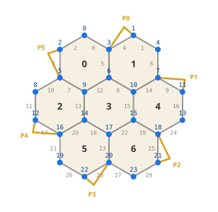
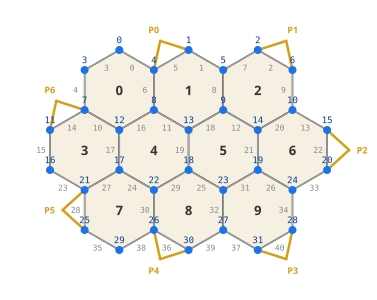
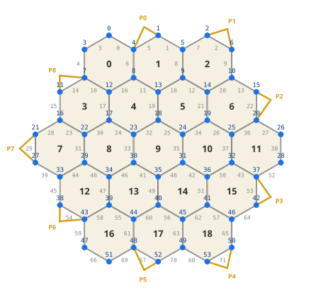

# Topology Reference

This document defines the coordinate system, element identities, and adjacency
relationships for hex-based Catan board layouts. It is the canonical reference
for the GimburAI engine. For the serialization format, see
[state-action-serialization.md](state-action-serialization.md).

---

## 1. Coordinate System

### 1.1 Tile Coordinates (Axial)

Tiles use **axial coordinates** `(q, r)` with the center tile at `(0, 0)`.

**Circular boards**: A hex grid of radius `R` contains all tiles where
`|q| <= R`, `|r| <= R`, and `|q + r| <= R`. The Mini (radius 1) and Standard
(radius 2) maps use this layout.

**Non-circular boards**: Some maps are defined by an explicit set of tile
coordinates rather than a radius formula. The Small map, for example, uses two
central hexes `(0,0)` and `(1,0)` with one layer of hexes around them,
forming a 10-tile oval shape. All other topology rules (vertex triplets, edge
identity, adjacency derivation) apply identically to non-circular boards.

The 6 axial neighbor directions, clockwise from east:

| Direction | dq | dr |
| --- | --- | --- |
| d0 (E)  | +1 |  0 |
| d1 (SE) | +1 | -1 |
| d2 (SW) |  0 | -1 |
| d3 (W)  | -1 |  0 |
| d4 (NW) | -1 | +1 |
| d5 (NE) |  0 | +1 |

Tile `(q, r)` has neighbor in direction `i` at `(q + di.q, r + di.r)`.
Neighbors outside the board radius are **virtual tiles** -- they don't exist on
the board but are used to define boundary vertex identity.

### 1.2 Hex Orientation and Pixel Mapping

**Pointy-top** hexagons viewed top-down. Pixel position:

```
x = size * sqrt(3) * (q + r / 2)
y = -size * 1.5 * r
```

**Tile index**: Tiles are sorted by screen position -- ascending `y` (top-to-
bottom), then ascending `x` (left-to-right).

Corner angles: `60 * i - 30` degrees (i = 0..5).

### 1.3 Vertex Identity (Triplet)

Every vertex sits at the meeting point of exactly 3 hex cells (some of which may
be virtual tiles off the board). A vertex is **uniquely identified** by the
sorted triplet of axial coordinates of those 3 cells.

For a tile at `(q, r)`, corner `i` (0..5) is shared with neighbors in
directions `di` and `d(i-1 mod 6)`:

```
corner_i(q, r) = sorted( (q, r),  (q, r) + d[i],  (q, r) + d[(i-1) % 6] )
```

| Corner | Angle | Shared with directions |
| --- | --- | --- |
| 0 | 30 deg  | d0 (E), d5 (NE) |
| 1 | 90 deg  | d1 (SE), d0 (E) |
| 2 | 150 deg | d2 (SW), d1 (SE) |
| 3 | 210 deg | d3 (W), d2 (SW) |
| 4 | 270 deg | d4 (NW), d3 (W) |
| 5 | 330 deg | d5 (NE), d4 (NW) |

**Vertex index**: Vertices are sorted by screen position of their pixel
coordinates (ascending `y`, then ascending `x`).

### 1.4 Edge Identity

An edge connects two adjacent vertices on a hex boundary. It is uniquely
identified by the **sorted pair of vertex triplets** of its two endpoints.

**Edge index**: Edges are sorted by `(vertex_A_index, vertex_B_index)`.

### 1.5 Port Identity

A port is a fixed position on the board perimeter where a player with a
settlement or city on one of its two vertices can trade at a favorable rate.
Each port is a **coastal edge** — an edge on the board perimeter connecting
two vertices.

Port positions are determined by walking the ring of coastal edges clockwise
from the top of the board and selecting evenly-spaced edges. For circular hex
boards of radius `R`, the port count is `3 × (R + 1)`. For non-circular boards,
the port count is specified explicitly when constructing the topology.

**Port index**: Ports are numbered 0..N-1 in clockwise order from the top.

Port **type** (3:1 generic, or 2:1 for a specific resource) is assigned during
game setup and is part of the game state, not the topology.

### 1.6 Summary of Identity

| Element | Identity | Index ordering |
| --- | --- | --- |
| Tile | axial `(q, r)` | screen position (y asc, x asc) |
| Vertex | sorted triplet of 3 tile `(q, r)` | screen position (y asc, x asc) |
| Edge | sorted pair of vertex triplets | `(min vertex index, max vertex index)` |
| Port | pair of vertex indices (coastal edge) | clockwise from top |

---

## 2. How Topology Defines a Game State

The board topology is a graph `G = (V, E)` where `V` is the set of vertices
and `E` is the set of edges, embedded in the plane with hex faces. The game
state is fully determined by assigning values to every element of this graph
plus some global/per-player scalars:

| What | Attached to | Values |
| --- | --- | --- |
| Resource type | each tile | desert, wood, brick, sheep, wheat, ore |
| Number token | each tile | 0 (desert), 2-6, 8-12 |
| Robber location | 1 tile index | 0..N-1 |
| Settlement/city | each vertex | empty, settlement(player), city(player) |
| Road | each edge | empty, road(player) |
| Port type | each port | 3:1, wood, brick, sheep, wheat, ore |
| Current player | global | 0..P-1 |
| Turn stage | global | placement / pre-roll / robber / build |
| Longest road owner | global | 0..P-1 |
| Largest army owner | global | 0..P-1 |
| Resources in hand | per player (5 types) | 0..99 |
| Knights played | per player | 0..99 |
| Dev cards in hand | per player (5 types) | 0..99 |

Because every tile, vertex, and edge has a **fixed index**, the entire state can
be serialized as a fixed-length vector of tokens (see
[state-action-serialization.md](state-action-serialization.md)). Two states are identical if
and only if their serialized vectors are identical.

### What is NOT stored (derivable)

- Remaining buildable pieces (settlements, cities, roads) -- derivable from
  placed pieces.
- Victory point totals -- derivable from vertex occupancy, dev cards, longest
  road, largest army.
- Available development card pool -- derivable from total cards minus all
  players' hands and played knights.

---

## 3. Computing Adjacency from First Principles

All adjacency relationships are derivable from two primitives:

1. **Vertex triplet**: for each vertex, the sorted set of 3 tile `(q, r)`.
2. **Edge endpoints**: for each edge, its two vertex indices.

### 3.1 Vertex -> Tiles

```
tiles_of(vertex) = { t in triplet(vertex) | t is on the board }
```

### 3.2 Tile -> Vertices

```
vertices_of(tile) = { v | tile's (q,r) in triplet(v) }
```

### 3.3 Edge -> Tiles

```
tiles_of(edge) = { t | t in triplet(endpointA) AND t in triplet(endpointB) AND t is on board }
```

### 3.4 Tile -> Edges

```
edges_of(tile) = { e | tile in tiles_of(e) }
```

### 3.5 Vertex -> Edges

```
edges_of(vertex) = { e | vertex in endpoints(e) }
```

### 3.6 Vertex -> Adjacent Vertices

```
neighbors(vertex) = { other_endpoint(e, vertex) | e in edges_of(vertex) }
```

### 3.7 Tile -> Adjacent Tiles

```
neighbors(tile) = { t2 | exists edge e where tiles_of(e) = {tile, t2} }
```

### 3.8 Coastal Test

```
is_coastal(edge) = |tiles_of(edge)| == 1
```

---

## 4. Mini Map (Radius 1)



### 4.1 Counts

| Element | Count |
| --- | --- |
| Tiles | 7 |
| Vertices | 24 |
| Edges | 30 |
| Ports | 6 |
| Coastal edges | 18 |
| Interior edges | 12 |
| Boundary vertices (degree 2) | 12 |
| Interior vertices (degree 3) | 12 |

Vertex tile-count distribution: 12 touch 1 tile, 6 touch 2 tiles, 6 touch 3 tiles.

Tile rows (top-to-bottom): 2, 3, 2.

Port types for the mini map (assigned during setup): 3 generic (3:1) and
3 resource-specific (2:1), chosen from the 5 resource types.

### 4.2 Tile Table

| Tile | q | r |
| --- | --- | --- |
| 0 | -1 | +1 |
| 1 | +0 | +1 |
| 2 | -1 | +0 |
| 3 | +0 | +0 |
| 4 | +1 | +0 |
| 5 | +0 | -1 |
| 6 | +1 | -1 |

### 4.3 Vertex Table

| Vertex | Triplet (tile axial coords) |
| --- | --- |
| 0 | (-2, +2) (-1, +1) (-1, +2) |
| 1 | (-1, +2) (+0, +1) (+0, +2) |
| 2 | (-2, +1) (-2, +2) (-1, +1) |
| 3 | (-1, +1) (-1, +2) (+0, +1) |
| 4 | (+0, +1) (+0, +2) (+1, +1) |
| 5 | (-2, +1) (-1, +0) (-1, +1) |
| 6 | (-1, +1) (+0, +0) (+0, +1) |
| 7 | (+0, +1) (+1, +0) (+1, +1) |
| 8 | (-2, +0) (-2, +1) (-1, +0) |
| 9 | (-1, +0) (-1, +1) (+0, +0) |
| 10 | (+0, +0) (+0, +1) (+1, +0) |
| 11 | (+1, +0) (+1, +1) (+2, +0) |
| 12 | (-2, +0) (-1, -1) (-1, +0) |
| 13 | (+1, +0) (+2, -1) (+2, +0) |
| 14 | (-1, +0) (+0, -1) (+0, +0) |
| 15 | (+0, +0) (+1, -1) (+1, +0) |
| 16 | (-1, -1) (-1, +0) (+0, -1) |
| 17 | (+0, -1) (+0, +0) (+1, -1) |
| 18 | (+1, -1) (+1, +0) (+2, -1) |
| 19 | (-1, -1) (+0, -2) (+0, -1) |
| 20 | (+0, -1) (+1, -2) (+1, -1) |
| 21 | (+1, -1) (+2, -2) (+2, -1) |
| 22 | (+0, -2) (+0, -1) (+1, -2) |
| 23 | (+1, -2) (+1, -1) (+2, -2) |

### 4.4 Edge Table

| Edge | Vertex A | Vertex B |
| --- | --- | --- |
| 0 | 0 | 3 |
| 1 | 1 | 4 |
| 2 | 2 | 0 |
| 3 | 2 | 5 |
| 4 | 3 | 1 |
| 5 | 3 | 6 |
| 6 | 4 | 7 |
| 7 | 5 | 9 |
| 8 | 6 | 10 |
| 9 | 7 | 11 |
| 10 | 8 | 5 |
| 11 | 8 | 12 |
| 12 | 9 | 6 |
| 13 | 9 | 14 |
| 14 | 10 | 7 |
| 15 | 10 | 15 |
| 16 | 11 | 13 |
| 17 | 12 | 16 |
| 18 | 14 | 17 |
| 19 | 15 | 18 |
| 20 | 16 | 14 |
| 21 | 16 | 19 |
| 22 | 17 | 15 |
| 23 | 17 | 20 |
| 24 | 18 | 13 |
| 25 | 18 | 21 |
| 26 | 19 | 22 |
| 27 | 20 | 23 |
| 28 | 22 | 20 |
| 29 | 23 | 21 |

### 4.5 Coastal Edges (18 total)

`0, 1, 2, 3, 4, 6, 9, 10, 11, 16, 17, 21, 24, 25, 26, 27, 28, 29`

### 4.6 Port Table (6 ports)

Ports are ordered clockwise from the top of the board. Each port is a
coastal edge connecting two vertices on the board perimeter.

| Port | Vertex A | Vertex B |
| --- | --- | --- |
| 0 | 3 | 1 |
| 1 | 7 | 11 |
| 2 | 18 | 21 |
| 3 | 20 | 22 |
| 4 | 16 | 12 |
| 5 | 5 | 2 |

### 4.7 Tile -> Vertices

Each tile has exactly 6 corner vertices.

| Tile | Vertices |
| --- | --- |
| 0 | 0, 2, 3, 5, 6, 9 |
| 1 | 1, 3, 4, 6, 7, 10 |
| 2 | 5, 8, 9, 12, 14, 16 |
| 3 | 6, 9, 10, 14, 15, 17 |
| 4 | 7, 10, 11, 13, 15, 18 |
| 5 | 14, 16, 17, 19, 20, 22 |
| 6 | 15, 17, 18, 20, 21, 23 |

### 4.8 Tile -> Edges

Each tile has exactly 6 boundary edges.

| Tile | Edges |
| --- | --- |
| 0 | 0, 2, 3, 5, 7, 12 |
| 1 | 1, 4, 5, 6, 8, 14 |
| 2 | 7, 10, 11, 13, 17, 20 |
| 3 | 8, 12, 13, 15, 18, 22 |
| 4 | 9, 14, 15, 16, 19, 24 |
| 5 | 18, 20, 21, 23, 26, 28 |
| 6 | 19, 22, 23, 25, 27, 29 |

### 4.9 Tile -> Adjacent Tiles

| Tile | Neighbors |
| --- | --- |
| 0 | 1, 2, 3 |
| 1 | 0, 3, 4 |
| 2 | 0, 3, 5 |
| 3 | 0, 1, 2, 4, 5, 6 |
| 4 | 1, 3, 6 |
| 5 | 2, 3, 6 |
| 6 | 3, 4, 5 |

### 4.10 Vertex -> Tiles

| Vertex | Tiles |
| --- | --- |
| 0 | 0 |
| 1 | 1 |
| 2 | 0 |
| 3 | 0, 1 |
| 4 | 1 |
| 5 | 0, 2 |
| 6 | 0, 1, 3 |
| 7 | 1, 4 |
| 8 | 2 |
| 9 | 0, 2, 3 |
| 10 | 1, 3, 4 |
| 11 | 4 |
| 12 | 2 |
| 13 | 4 |
| 14 | 2, 3, 5 |
| 15 | 3, 4, 6 |
| 16 | 2, 5 |
| 17 | 3, 5, 6 |
| 18 | 4, 6 |
| 19 | 5 |
| 20 | 5, 6 |
| 21 | 6 |
| 22 | 5 |
| 23 | 6 |

### 4.11 Vertex -> Edges

| Vertex | Edges |
| --- | --- |
| 0 | 0, 2 |
| 1 | 1, 4 |
| 2 | 2, 3 |
| 3 | 0, 4, 5 |
| 4 | 1, 6 |
| 5 | 3, 7, 10 |
| 6 | 5, 8, 12 |
| 7 | 6, 9, 14 |
| 8 | 10, 11 |
| 9 | 7, 12, 13 |
| 10 | 8, 14, 15 |
| 11 | 9, 16 |
| 12 | 11, 17 |
| 13 | 16, 24 |
| 14 | 13, 18, 20 |
| 15 | 15, 19, 22 |
| 16 | 17, 20, 21 |
| 17 | 18, 22, 23 |
| 18 | 19, 24, 25 |
| 19 | 21, 26 |
| 20 | 23, 27, 28 |
| 21 | 25, 29 |
| 22 | 26, 28 |
| 23 | 27, 29 |

### 4.12 Vertex -> Adjacent Vertices

| Vertex | Neighbors |
| --- | --- |
| 0 | 2, 3 |
| 1 | 3, 4 |
| 2 | 0, 5 |
| 3 | 0, 1, 6 |
| 4 | 1, 7 |
| 5 | 2, 8, 9 |
| 6 | 3, 9, 10 |
| 7 | 4, 10, 11 |
| 8 | 5, 12 |
| 9 | 5, 6, 14 |
| 10 | 6, 7, 15 |
| 11 | 7, 13 |
| 12 | 8, 16 |
| 13 | 11, 18 |
| 14 | 9, 16, 17 |
| 15 | 10, 17, 18 |
| 16 | 12, 14, 19 |
| 17 | 14, 15, 20 |
| 18 | 13, 15, 21 |
| 19 | 16, 22 |
| 20 | 17, 22, 23 |
| 21 | 18, 23 |
| 22 | 19, 20 |
| 23 | 20, 21 |

### 4.13 Edge -> Vertices

| Edge | Vertex A | Vertex B |
| --- | --- | --- |
| 0 | 0 | 3 |
| 1 | 1 | 4 |
| 2 | 2 | 0 |
| 3 | 2 | 5 |
| 4 | 3 | 1 |
| 5 | 3 | 6 |
| 6 | 4 | 7 |
| 7 | 5 | 9 |
| 8 | 6 | 10 |
| 9 | 7 | 11 |
| 10 | 8 | 5 |
| 11 | 8 | 12 |
| 12 | 9 | 6 |
| 13 | 9 | 14 |
| 14 | 10 | 7 |
| 15 | 10 | 15 |
| 16 | 11 | 13 |
| 17 | 12 | 16 |
| 18 | 14 | 17 |
| 19 | 15 | 18 |
| 20 | 16 | 14 |
| 21 | 16 | 19 |
| 22 | 17 | 15 |
| 23 | 17 | 20 |
| 24 | 18 | 13 |
| 25 | 18 | 21 |
| 26 | 19 | 22 |
| 27 | 20 | 23 |
| 28 | 22 | 20 |
| 29 | 23 | 21 |

### 4.14 Edge -> Tiles

| Edge | Tiles |
| --- | --- |
| 0 | 0 |
| 1 | 1 |
| 2 | 0 |
| 3 | 0 |
| 4 | 1 |
| 5 | 0, 1 |
| 6 | 1 |
| 7 | 0, 2 |
| 8 | 1, 3 |
| 9 | 4 |
| 10 | 2 |
| 11 | 2 |
| 12 | 0, 3 |
| 13 | 2, 3 |
| 14 | 1, 4 |
| 15 | 3, 4 |
| 16 | 4 |
| 17 | 2 |
| 18 | 3, 5 |
| 19 | 4, 6 |
| 20 | 2, 5 |
| 21 | 5 |
| 22 | 3, 6 |
| 23 | 5, 6 |
| 24 | 4 |
| 25 | 6 |
| 26 | 5 |
| 27 | 6 |
| 28 | 5 |
| 29 | 6 |

### 4.15 Action Table (60 actions)

Each action represents a settlement vertex + road direction pair for the
[placement action tokenizer](state-action-serialization.md#part-iii-placement-action-serialization).
The public clockwise direction-index order is `N, NE, SE, S, SW, NW`.
Tables are sorted by vertex index, then direction string. Symmetry transforms a
direction by permuting its vertex and edge and resolving the transformed pair.

| Token | Action | Vertex | Direction | Edge |
| --- | --- | --- | --- | --- |
| 0 | 0SE | 0 | SE | 0 |
| 1 | 0SW | 0 | SW | 2 |
| 2 | 1SE | 1 | SE | 1 |
| 3 | 1SW | 1 | SW | 4 |
| 4 | 2NE | 2 | NE | 2 |
| 5 | 2S | 2 | S | 3 |
| 6 | 3NE | 3 | NE | 4 |
| 7 | 3NW | 3 | NW | 0 |
| 8 | 3S | 3 | S | 5 |
| 9 | 4NW | 4 | NW | 1 |
| 10 | 4S | 4 | S | 6 |
| 11 | 5N | 5 | N | 3 |
| 12 | 5SE | 5 | SE | 7 |
| 13 | 5SW | 5 | SW | 10 |
| 14 | 6N | 6 | N | 5 |
| 15 | 6SE | 6 | SE | 8 |
| 16 | 6SW | 6 | SW | 12 |
| 17 | 7N | 7 | N | 6 |
| 18 | 7SE | 7 | SE | 9 |
| 19 | 7SW | 7 | SW | 14 |
| 20 | 8NE | 8 | NE | 10 |
| 21 | 8S | 8 | S | 11 |
| 22 | 9NE | 9 | NE | 12 |
| 23 | 9NW | 9 | NW | 7 |
| 24 | 9S | 9 | S | 13 |
| 25 | 10NE | 10 | NE | 14 |
| 26 | 10NW | 10 | NW | 8 |
| 27 | 10S | 10 | S | 15 |
| 28 | 11NW | 11 | NW | 9 |
| 29 | 11S | 11 | S | 16 |
| 30 | 12N | 12 | N | 11 |
| 31 | 12SE | 12 | SE | 17 |
| 32 | 13N | 13 | N | 16 |
| 33 | 13SW | 13 | SW | 24 |
| 34 | 14N | 14 | N | 13 |
| 35 | 14SE | 14 | SE | 18 |
| 36 | 14SW | 14 | SW | 20 |
| 37 | 15N | 15 | N | 15 |
| 38 | 15SE | 15 | SE | 19 |
| 39 | 15SW | 15 | SW | 22 |
| 40 | 16NE | 16 | NE | 20 |
| 41 | 16NW | 16 | NW | 17 |
| 42 | 16S | 16 | S | 21 |
| 43 | 17NE | 17 | NE | 22 |
| 44 | 17NW | 17 | NW | 18 |
| 45 | 17S | 17 | S | 23 |
| 46 | 18NE | 18 | NE | 24 |
| 47 | 18NW | 18 | NW | 19 |
| 48 | 18S | 18 | S | 25 |
| 49 | 19N | 19 | N | 21 |
| 50 | 19SE | 19 | SE | 26 |
| 51 | 20N | 20 | N | 23 |
| 52 | 20SE | 20 | SE | 27 |
| 53 | 20SW | 20 | SW | 28 |
| 54 | 21N | 21 | N | 25 |
| 55 | 21SW | 21 | SW | 29 |
| 56 | 22NE | 22 | NE | 28 |
| 57 | 22NW | 22 | NW | 26 |
| 58 | 23NE | 23 | NE | 29 |
| 59 | 23NW | 23 | NW | 27 |

---

## 5. Small Map (10 tiles, non-circular)



The Small map is a non-circular oval board built from two central hexes
`(0,0)` and `(1,0)` plus one ring of hexes around them. This produces 10
tiles arranged in rows of 3, 4, 3 (top to bottom).

### 5.1 Counts

| Element | Count |
| --- | --- |
| Tiles | 10 |
| Vertices | 32 |
| Edges | 41 |
| Ports | 6 |
| Coastal edges | 22 |
| Interior edges | 19 |
| Boundary vertices (degree 2) | 14 |
| Interior vertices (degree 3) | 18 |

Vertex tile-count distribution: 10 touch 1 tile, 8 touch 2 tiles, 14 touch 3 tiles.

Tile rows (top-to-bottom): 3, 4, 3.

Port types for the small map (assigned during setup): 2 generic (3:1) and
4 resource-specific (2:1 wood, brick, sheep, wheat).

Port positions are 180° rotationally symmetric: the 6 ports form 3
pairs where each port's partner occupies the diametrically opposite
position on the board perimeter.

### 5.2 Tile Table

| Tile | q | r |
| --- | --- | --- |
| 0 | -1 | +1 |
| 1 | +0 | +1 |
| 2 | +1 | +1 |
| 3 | -1 | +0 |
| 4 | +0 | +0 |
| 5 | +1 | +0 |
| 6 | +2 | +0 |
| 7 | +0 | -1 |
| 8 | +1 | -1 |
| 9 | +2 | -1 |

### 5.3 Vertex Table

| Vertex | Triplet (tile axial coords) |
| --- | --- |
| 0 | (-2, +2) (-1, +1) (-1, +2) |
| 1 | (-1, +2) (+0, +1) (+0, +2) |
| 2 | (+0, +2) (+1, +1) (+1, +2) |
| 3 | (-2, +1) (-2, +2) (-1, +1) |
| 4 | (-1, +1) (-1, +2) (+0, +1) |
| 5 | (+0, +1) (+0, +2) (+1, +1) |
| 6 | (+1, +1) (+1, +2) (+2, +1) |
| 7 | (-2, +1) (-1, +0) (-1, +1) |
| 8 | (-1, +1) (+0, +0) (+0, +1) |
| 9 | (+0, +1) (+1, +0) (+1, +1) |
| 10 | (+1, +1) (+2, +0) (+2, +1) |
| 11 | (-2, +0) (-2, +1) (-1, +0) |
| 12 | (-1, +0) (-1, +1) (+0, +0) |
| 13 | (+0, +0) (+0, +1) (+1, +0) |
| 14 | (+1, +0) (+1, +1) (+2, +0) |
| 15 | (+2, +0) (+2, +1) (+3, +0) |
| 16 | (-2, +0) (-1, -1) (-1, +0) |
| 17 | (-1, +0) (+0, -1) (+0, +0) |
| 18 | (+0, +0) (+1, -1) (+1, +0) |
| 19 | (+1, +0) (+2, -1) (+2, +0) |
| 20 | (+2, +0) (+3, -1) (+3, +0) |
| 21 | (-1, -1) (-1, +0) (+0, -1) |
| 22 | (+0, -1) (+0, +0) (+1, -1) |
| 23 | (+1, -1) (+1, +0) (+2, -1) |
| 24 | (+2, -1) (+2, +0) (+3, -1) |
| 25 | (-1, -1) (+0, -2) (+0, -1) |
| 26 | (+0, -1) (+1, -2) (+1, -1) |
| 27 | (+1, -1) (+2, -2) (+2, -1) |
| 28 | (+2, -1) (+3, -2) (+3, -1) |
| 29 | (+0, -2) (+0, -1) (+1, -2) |
| 30 | (+1, -2) (+1, -1) (+2, -2) |
| 31 | (+2, -2) (+2, -1) (+3, -2) |

### 5.4 Edge Table

| Edge | Vertex A | Vertex B |
| --- | --- | --- |
| 0 | 0 | 3 |
| 1 | 0 | 4 |
| 2 | 1 | 4 |
| 3 | 1 | 5 |
| 4 | 2 | 5 |
| 5 | 2 | 6 |
| 6 | 3 | 7 |
| 7 | 4 | 8 |
| 8 | 5 | 9 |
| 9 | 6 | 10 |
| 10 | 7 | 11 |
| 11 | 7 | 12 |
| 12 | 8 | 12 |
| 13 | 8 | 13 |
| 14 | 9 | 13 |
| 15 | 9 | 14 |
| 16 | 10 | 14 |
| 17 | 10 | 15 |
| 18 | 11 | 16 |
| 19 | 12 | 17 |
| 20 | 13 | 18 |
| 21 | 14 | 19 |
| 22 | 15 | 20 |
| 23 | 16 | 21 |
| 24 | 17 | 21 |
| 25 | 17 | 22 |
| 26 | 18 | 22 |
| 27 | 18 | 23 |
| 28 | 19 | 23 |
| 29 | 19 | 24 |
| 30 | 20 | 24 |
| 31 | 21 | 25 |
| 32 | 22 | 26 |
| 33 | 23 | 27 |
| 34 | 24 | 28 |
| 35 | 25 | 29 |
| 36 | 26 | 29 |
| 37 | 26 | 30 |
| 38 | 27 | 30 |
| 39 | 27 | 31 |
| 40 | 28 | 31 |

### 5.5 Coastal Edges (22 total)

`0, 1, 2, 3, 4, 5, 6, 9, 10, 17, 18, 22, 23, 30, 31, 34, 35, 36, 37, 38, 39, 40`

### 5.6 Port Table (6 ports)

Ports are ordered clockwise from the top of the board. Each port is a
coastal edge connecting two vertices on the board perimeter. The 6 ports
are 180° rotationally symmetric: P0 pairs with P3, P1 with P4, and P2
with P5.

| Port | Vertex A | Vertex B |
| --- | --- | --- |
| 0 | 4 | 1 |
| 1 | 2 | 6 |
| 2 | 20 | 24 |
| 3 | 27 | 30 |
| 4 | 29 | 25 |
| 5 | 11 | 7 |

### 5.7 Tile -> Vertices

Each tile has exactly 6 corner vertices.

| Tile | Vertices |
| --- | --- |
| 0 | 0, 3, 4, 7, 8, 12 |
| 1 | 1, 4, 5, 8, 9, 13 |
| 2 | 2, 5, 6, 9, 10, 14 |
| 3 | 7, 11, 12, 16, 17, 21 |
| 4 | 8, 12, 13, 17, 18, 22 |
| 5 | 9, 13, 14, 18, 19, 23 |
| 6 | 10, 14, 15, 19, 20, 24 |
| 7 | 17, 21, 22, 25, 26, 29 |
| 8 | 18, 22, 23, 26, 27, 30 |
| 9 | 19, 23, 24, 27, 28, 31 |

### 5.8 Tile -> Edges

Each tile has exactly 6 boundary edges.

| Tile | Edges |
| --- | --- |
| 0 | 0, 1, 6, 7, 11, 12 |
| 1 | 2, 3, 7, 8, 13, 14 |
| 2 | 4, 5, 8, 9, 15, 16 |
| 3 | 10, 11, 18, 19, 23, 24 |
| 4 | 12, 13, 19, 20, 25, 26 |
| 5 | 14, 15, 20, 21, 27, 28 |
| 6 | 16, 17, 21, 22, 29, 30 |
| 7 | 24, 25, 31, 32, 35, 36 |
| 8 | 26, 27, 32, 33, 37, 38 |
| 9 | 28, 29, 33, 34, 39, 40 |

### 5.9 Tile -> Adjacent Tiles

| Tile | Neighbors |
| --- | --- |
| 0 | 1, 3, 4 |
| 1 | 0, 2, 4, 5 |
| 2 | 1, 5, 6 |
| 3 | 0, 4, 7 |
| 4 | 0, 1, 3, 5, 7, 8 |
| 5 | 1, 2, 4, 6, 8, 9 |
| 6 | 2, 5, 9 |
| 7 | 3, 4, 8 |
| 8 | 4, 5, 7, 9 |
| 9 | 5, 6, 8 |

### 5.10 Vertex -> Tiles

| Vertex | Tiles |
| --- | --- |
| 0 | 0 |
| 1 | 1 |
| 2 | 2 |
| 3 | 0 |
| 4 | 0, 1 |
| 5 | 1, 2 |
| 6 | 2 |
| 7 | 0, 3 |
| 8 | 0, 1, 4 |
| 9 | 1, 2, 5 |
| 10 | 2, 6 |
| 11 | 3 |
| 12 | 0, 3, 4 |
| 13 | 1, 4, 5 |
| 14 | 2, 5, 6 |
| 15 | 6 |
| 16 | 3 |
| 17 | 3, 4, 7 |
| 18 | 4, 5, 8 |
| 19 | 5, 6, 9 |
| 20 | 6 |
| 21 | 3, 7 |
| 22 | 4, 7, 8 |
| 23 | 5, 8, 9 |
| 24 | 6, 9 |
| 25 | 7 |
| 26 | 7, 8 |
| 27 | 8, 9 |
| 28 | 9 |
| 29 | 7 |
| 30 | 8 |
| 31 | 9 |

### 5.11 Vertex -> Edges

| Vertex | Edges |
| --- | --- |
| 0 | 0, 1 |
| 1 | 2, 3 |
| 2 | 4, 5 |
| 3 | 0, 6 |
| 4 | 1, 2, 7 |
| 5 | 3, 4, 8 |
| 6 | 5, 9 |
| 7 | 6, 10, 11 |
| 8 | 7, 12, 13 |
| 9 | 8, 14, 15 |
| 10 | 9, 16, 17 |
| 11 | 10, 18 |
| 12 | 11, 12, 19 |
| 13 | 13, 14, 20 |
| 14 | 15, 16, 21 |
| 15 | 17, 22 |
| 16 | 18, 23 |
| 17 | 19, 24, 25 |
| 18 | 20, 26, 27 |
| 19 | 21, 28, 29 |
| 20 | 22, 30 |
| 21 | 23, 24, 31 |
| 22 | 25, 26, 32 |
| 23 | 27, 28, 33 |
| 24 | 29, 30, 34 |
| 25 | 31, 35 |
| 26 | 32, 36, 37 |
| 27 | 33, 38, 39 |
| 28 | 34, 40 |
| 29 | 35, 36 |
| 30 | 37, 38 |
| 31 | 39, 40 |

### 5.12 Vertex -> Adjacent Vertices

| Vertex | Neighbors |
| --- | --- |
| 0 | 3, 4 |
| 1 | 4, 5 |
| 2 | 5, 6 |
| 3 | 0, 7 |
| 4 | 0, 1, 8 |
| 5 | 1, 2, 9 |
| 6 | 2, 10 |
| 7 | 3, 11, 12 |
| 8 | 4, 12, 13 |
| 9 | 5, 13, 14 |
| 10 | 6, 14, 15 |
| 11 | 7, 16 |
| 12 | 7, 8, 17 |
| 13 | 8, 9, 18 |
| 14 | 9, 10, 19 |
| 15 | 10, 20 |
| 16 | 11, 21 |
| 17 | 12, 21, 22 |
| 18 | 13, 22, 23 |
| 19 | 14, 23, 24 |
| 20 | 15, 24 |
| 21 | 16, 17, 25 |
| 22 | 17, 18, 26 |
| 23 | 18, 19, 27 |
| 24 | 19, 20, 28 |
| 25 | 21, 29 |
| 26 | 22, 29, 30 |
| 27 | 23, 30, 31 |
| 28 | 24, 31 |
| 29 | 25, 26 |
| 30 | 26, 27 |
| 31 | 27, 28 |

### 5.13 Edge -> Vertices

| Edge | Vertex A | Vertex B |
| --- | --- | --- |
| 0 | 0 | 3 |
| 1 | 0 | 4 |
| 2 | 1 | 4 |
| 3 | 1 | 5 |
| 4 | 2 | 5 |
| 5 | 2 | 6 |
| 6 | 3 | 7 |
| 7 | 4 | 8 |
| 8 | 5 | 9 |
| 9 | 6 | 10 |
| 10 | 7 | 11 |
| 11 | 7 | 12 |
| 12 | 8 | 12 |
| 13 | 8 | 13 |
| 14 | 9 | 13 |
| 15 | 9 | 14 |
| 16 | 10 | 14 |
| 17 | 10 | 15 |
| 18 | 11 | 16 |
| 19 | 12 | 17 |
| 20 | 13 | 18 |
| 21 | 14 | 19 |
| 22 | 15 | 20 |
| 23 | 16 | 21 |
| 24 | 17 | 21 |
| 25 | 17 | 22 |
| 26 | 18 | 22 |
| 27 | 18 | 23 |
| 28 | 19 | 23 |
| 29 | 19 | 24 |
| 30 | 20 | 24 |
| 31 | 21 | 25 |
| 32 | 22 | 26 |
| 33 | 23 | 27 |
| 34 | 24 | 28 |
| 35 | 25 | 29 |
| 36 | 26 | 29 |
| 37 | 26 | 30 |
| 38 | 27 | 30 |
| 39 | 27 | 31 |
| 40 | 28 | 31 |

### 5.14 Edge -> Tiles

| Edge | Tiles |
| --- | --- |
| 0 | 0 |
| 1 | 0 |
| 2 | 1 |
| 3 | 1 |
| 4 | 2 |
| 5 | 2 |
| 6 | 0 |
| 7 | 0, 1 |
| 8 | 1, 2 |
| 9 | 2 |
| 10 | 3 |
| 11 | 0, 3 |
| 12 | 0, 4 |
| 13 | 1, 4 |
| 14 | 1, 5 |
| 15 | 2, 5 |
| 16 | 2, 6 |
| 17 | 6 |
| 18 | 3 |
| 19 | 3, 4 |
| 20 | 4, 5 |
| 21 | 5, 6 |
| 22 | 6 |
| 23 | 3 |
| 24 | 3, 7 |
| 25 | 4, 7 |
| 26 | 4, 8 |
| 27 | 5, 8 |
| 28 | 5, 9 |
| 29 | 6, 9 |
| 30 | 6 |
| 31 | 7 |
| 32 | 7, 8 |
| 33 | 8, 9 |
| 34 | 9 |
| 35 | 7 |
| 36 | 7 |
| 37 | 8 |
| 38 | 8 |
| 39 | 9 |
| 40 | 9 |

### 5.15 Action Table (82 actions)

Each action represents a settlement vertex + road direction pair for the
[placement action tokenizer](state-action-serialization.md#part-iii-placement-action-serialization).
Sorted by vertex index, then direction.

| Token | Action | Vertex | Direction | Edge |
| --- | --- | --- | --- | --- |
| 0 | 0SE | 0 | SE | 0 |
| 1 | 0SW | 0 | SW | 3 |
| 2 | 1SE | 1 | SE | 1 |
| 3 | 1SW | 1 | SW | 5 |
| 4 | 2SE | 2 | SE | 2 |
| 5 | 2SW | 2 | SW | 7 |
| 6 | 3NE | 3 | NE | 3 |
| 7 | 3S | 3 | S | 4 |
| 8 | 4NE | 4 | NE | 5 |
| 9 | 4NW | 4 | NW | 0 |
| 10 | 4S | 4 | S | 6 |
| 11 | 5NE | 5 | NE | 7 |
| 12 | 5NW | 5 | NW | 1 |
| 13 | 5S | 5 | S | 8 |
| 14 | 6NW | 6 | NW | 2 |
| 15 | 6S | 6 | S | 9 |
| 16 | 7N | 7 | N | 4 |
| 17 | 7SE | 7 | SE | 10 |
| 18 | 7SW | 7 | SW | 14 |
| 19 | 8N | 8 | N | 6 |
| 20 | 8SE | 8 | SE | 11 |
| 21 | 8SW | 8 | SW | 16 |
| 22 | 9N | 9 | N | 8 |
| 23 | 9SE | 9 | SE | 12 |
| 24 | 9SW | 9 | SW | 18 |
| 25 | 10N | 10 | N | 9 |
| 26 | 10SE | 10 | SE | 13 |
| 27 | 10SW | 10 | SW | 20 |
| 28 | 11NE | 11 | NE | 14 |
| 29 | 11S | 11 | S | 15 |
| 30 | 12NE | 12 | NE | 16 |
| 31 | 12NW | 12 | NW | 10 |
| 32 | 12S | 12 | S | 17 |
| 33 | 13NE | 13 | NE | 18 |
| 34 | 13NW | 13 | NW | 11 |
| 35 | 13S | 13 | S | 19 |
| 36 | 14NE | 14 | NE | 20 |
| 37 | 14NW | 14 | NW | 12 |
| 38 | 14S | 14 | S | 21 |
| 39 | 15NW | 15 | NW | 13 |
| 40 | 15S | 15 | S | 22 |
| 41 | 16N | 16 | N | 15 |
| 42 | 16SE | 16 | SE | 23 |
| 43 | 17N | 17 | N | 17 |
| 44 | 17SE | 17 | SE | 24 |
| 45 | 17SW | 17 | SW | 27 |
| 46 | 18N | 18 | N | 19 |
| 47 | 18SE | 18 | SE | 25 |
| 48 | 18SW | 18 | SW | 29 |
| 49 | 19N | 19 | N | 21 |
| 50 | 19SE | 19 | SE | 26 |
| 51 | 19SW | 19 | SW | 31 |
| 52 | 20N | 20 | N | 22 |
| 53 | 20SW | 20 | SW | 33 |
| 54 | 21NE | 21 | NE | 27 |
| 55 | 21NW | 21 | NW | 23 |
| 56 | 21S | 21 | S | 28 |
| 57 | 22NE | 22 | NE | 29 |
| 58 | 22NW | 22 | NW | 24 |
| 59 | 22S | 22 | S | 30 |
| 60 | 23NE | 23 | NE | 31 |
| 61 | 23NW | 23 | NW | 25 |
| 62 | 23S | 23 | S | 32 |
| 63 | 24NE | 24 | NE | 33 |
| 64 | 24NW | 24 | NW | 26 |
| 65 | 24S | 24 | S | 34 |
| 66 | 25N | 25 | N | 28 |
| 67 | 25SE | 25 | SE | 35 |
| 68 | 26N | 26 | N | 30 |
| 69 | 26SE | 26 | SE | 36 |
| 70 | 26SW | 26 | SW | 38 |
| 71 | 27N | 27 | N | 32 |
| 72 | 27SE | 27 | SE | 37 |
| 73 | 27SW | 27 | SW | 39 |
| 74 | 28N | 28 | N | 34 |
| 75 | 28SW | 28 | SW | 40 |
| 76 | 29NE | 29 | NE | 38 |
| 77 | 29NW | 29 | NW | 35 |
| 78 | 30NE | 30 | NE | 39 |
| 79 | 30NW | 30 | NW | 36 |
| 80 | 31NE | 31 | NE | 40 |
| 81 | 31NW | 31 | NW | 37 |

---

## 6. Standard Map (Radius 2)



### 6.1 Counts

| Element | Count |
| --- | --- |
| Tiles | 19 |
| Vertices | 54 |
| Edges | 72 |
| Ports | 9 |
| Coastal edges | 30 |
| Interior edges | 42 |
| Boundary vertices (degree 2) | 18 |
| Interior vertices (degree 3) | 36 |

Vertex tile-count distribution: 18 touch 1 tile, 12 touch 2 tiles, 24 touch 3 tiles.

Tile rows (top-to-bottom): 3, 4, 5, 4, 3.

Port types for the standard map (assigned during setup): 4 generic (3:1) and
5 resource-specific (2:1 wood, brick, sheep, wheat, ore).

### 6.2 Tile Table

| Tile | q | r |
| --- | --- | --- |
| 0 | -2 | +2 |
| 1 | -1 | +2 |
| 2 | +0 | +2 |
| 3 | -2 | +1 |
| 4 | -1 | +1 |
| 5 | +0 | +1 |
| 6 | +1 | +1 |
| 7 | -2 | +0 |
| 8 | -1 | +0 |
| 9 | +0 | +0 |
| 10 | +1 | +0 |
| 11 | +2 | +0 |
| 12 | -1 | -1 |
| 13 | +0 | -1 |
| 14 | +1 | -1 |
| 15 | +2 | -1 |
| 16 | +0 | -2 |
| 17 | +1 | -2 |
| 18 | +2 | -2 |

### 6.3 Vertex Table

| Vertex | Triplet (tile axial coords) |
| --- | --- |
| 0 | (-3, +3) (-2, +2) (-2, +3) |
| 1 | (-2, +3) (-1, +2) (-1, +3) |
| 2 | (-1, +3) (+0, +2) (+0, +3) |
| 3 | (-3, +2) (-3, +3) (-2, +2) |
| 4 | (-2, +2) (-2, +3) (-1, +2) |
| 5 | (-1, +2) (-1, +3) (+0, +2) |
| 6 | (+0, +2) (+0, +3) (+1, +2) |
| 7 | (-3, +2) (-2, +1) (-2, +2) |
| 8 | (-2, +2) (-1, +1) (-1, +2) |
| 9 | (-1, +2) (+0, +1) (+0, +2) |
| 10 | (+0, +2) (+1, +1) (+1, +2) |
| 11 | (-3, +1) (-3, +2) (-2, +1) |
| 12 | (-2, +1) (-2, +2) (-1, +1) |
| 13 | (-1, +1) (-1, +2) (+0, +1) |
| 14 | (+0, +1) (+0, +2) (+1, +1) |
| 15 | (+1, +1) (+1, +2) (+2, +1) |
| 16 | (-3, +1) (-2, +0) (-2, +1) |
| 17 | (-2, +1) (-1, +0) (-1, +1) |
| 18 | (-1, +1) (+0, +0) (+0, +1) |
| 19 | (+0, +1) (+1, +0) (+1, +1) |
| 20 | (+1, +1) (+2, +0) (+2, +1) |
| 21 | (-3, +0) (-3, +1) (-2, +0) |
| 22 | (-2, +0) (-2, +1) (-1, +0) |
| 23 | (-1, +0) (-1, +1) (+0, +0) |
| 24 | (+0, +0) (+0, +1) (+1, +0) |
| 25 | (+1, +0) (+1, +1) (+2, +0) |
| 26 | (+2, +0) (+2, +1) (+3, +0) |
| 27 | (-3, +0) (-2, -1) (-2, +0) |
| 28 | (+2, +0) (+3, -1) (+3, +0) |
| 29 | (-2, +0) (-1, -1) (-1, +0) |
| 30 | (-1, +0) (+0, -1) (+0, +0) |
| 31 | (+0, +0) (+1, -1) (+1, +0) |
| 32 | (+1, +0) (+2, -1) (+2, +0) |
| 33 | (-2, -1) (-2, +0) (-1, -1) |
| 34 | (-1, -1) (-1, +0) (+0, -1) |
| 35 | (+0, -1) (+0, +0) (+1, -1) |
| 36 | (+1, -1) (+1, +0) (+2, -1) |
| 37 | (+2, -1) (+2, +0) (+3, -1) |
| 38 | (-2, -1) (-1, -2) (-1, -1) |
| 39 | (-1, -1) (+0, -2) (+0, -1) |
| 40 | (+0, -1) (+1, -2) (+1, -1) |
| 41 | (+1, -1) (+2, -2) (+2, -1) |
| 42 | (+2, -1) (+3, -2) (+3, -1) |
| 43 | (-1, -2) (-1, -1) (+0, -2) |
| 44 | (+0, -2) (+0, -1) (+1, -2) |
| 45 | (+1, -2) (+1, -1) (+2, -2) |
| 46 | (+2, -2) (+2, -1) (+3, -2) |
| 47 | (-1, -2) (+0, -3) (+0, -2) |
| 48 | (+0, -2) (+1, -3) (+1, -2) |
| 49 | (+1, -2) (+2, -3) (+2, -2) |
| 50 | (+2, -2) (+3, -3) (+3, -2) |
| 51 | (+0, -3) (+0, -2) (+1, -3) |
| 52 | (+1, -3) (+1, -2) (+2, -3) |
| 53 | (+2, -3) (+2, -2) (+3, -3) |

### 6.4 Edge Table

| Edge | Vertex A | Vertex B |
| --- | --- | --- |
| 0 | 0 | 4 |
| 1 | 1 | 5 |
| 2 | 2 | 6 |
| 3 | 3 | 0 |
| 4 | 3 | 7 |
| 5 | 4 | 1 |
| 6 | 4 | 8 |
| 7 | 5 | 2 |
| 8 | 5 | 9 |
| 9 | 6 | 10 |
| 10 | 7 | 12 |
| 11 | 8 | 13 |
| 12 | 9 | 14 |
| 13 | 10 | 15 |
| 14 | 11 | 7 |
| 15 | 11 | 16 |
| 16 | 12 | 8 |
| 17 | 12 | 17 |
| 18 | 13 | 9 |
| 19 | 13 | 18 |
| 20 | 14 | 10 |
| 21 | 14 | 19 |
| 22 | 15 | 20 |
| 23 | 16 | 22 |
| 24 | 17 | 23 |
| 25 | 18 | 24 |
| 26 | 19 | 25 |
| 27 | 20 | 26 |
| 28 | 21 | 16 |
| 29 | 21 | 27 |
| 30 | 22 | 17 |
| 31 | 22 | 29 |
| 32 | 23 | 18 |
| 33 | 23 | 30 |
| 34 | 24 | 19 |
| 35 | 24 | 31 |
| 36 | 25 | 20 |
| 37 | 25 | 32 |
| 38 | 26 | 28 |
| 39 | 27 | 33 |
| 40 | 29 | 34 |
| 41 | 30 | 35 |
| 42 | 31 | 36 |
| 43 | 32 | 37 |
| 44 | 33 | 29 |
| 45 | 33 | 38 |
| 46 | 34 | 30 |
| 47 | 34 | 39 |
| 48 | 35 | 31 |
| 49 | 35 | 40 |
| 50 | 36 | 32 |
| 51 | 36 | 41 |
| 52 | 37 | 28 |
| 53 | 37 | 42 |
| 54 | 38 | 43 |
| 55 | 39 | 44 |
| 56 | 40 | 45 |
| 57 | 41 | 46 |
| 58 | 43 | 39 |
| 59 | 43 | 47 |
| 60 | 44 | 40 |
| 61 | 44 | 48 |
| 62 | 45 | 41 |
| 63 | 45 | 49 |
| 64 | 46 | 42 |
| 65 | 46 | 50 |
| 66 | 47 | 51 |
| 67 | 48 | 52 |
| 68 | 49 | 53 |
| 69 | 51 | 48 |
| 70 | 52 | 49 |
| 71 | 53 | 50 |

### 6.5 Coastal Edges (30 total)

`0, 1, 2, 3, 4, 5, 7, 9, 13, 14, 15, 22, 27, 28, 29, 38, 39, 45, 52, 53, 54, 59, 64, 65, 66, 67, 68, 69, 70, 71`

### 6.6 Port Table (9 ports)

Ports are ordered clockwise from the top of the board. Each port is a
coastal edge connecting two vertices on the board perimeter.

| Port | Vertex A | Vertex B |
| --- | --- | --- |
| 0 | 4 | 1 |
| 1 | 2 | 6 |
| 2 | 15 | 20 |
| 3 | 37 | 42 |
| 4 | 50 | 53 |
| 5 | 52 | 48 |
| 6 | 43 | 38 |
| 7 | 27 | 21 |
| 8 | 11 | 7 |

### 6.7 Tile -> Vertices

Each tile has exactly 6 corner vertices.

| Tile | Vertices |
| --- | --- |
| 0 | 0, 3, 4, 7, 8, 12 |
| 1 | 1, 4, 5, 8, 9, 13 |
| 2 | 2, 5, 6, 9, 10, 14 |
| 3 | 7, 11, 12, 16, 17, 22 |
| 4 | 8, 12, 13, 17, 18, 23 |
| 5 | 9, 13, 14, 18, 19, 24 |
| 6 | 10, 14, 15, 19, 20, 25 |
| 7 | 16, 21, 22, 27, 29, 33 |
| 8 | 17, 22, 23, 29, 30, 34 |
| 9 | 18, 23, 24, 30, 31, 35 |
| 10 | 19, 24, 25, 31, 32, 36 |
| 11 | 20, 25, 26, 28, 32, 37 |
| 12 | 29, 33, 34, 38, 39, 43 |
| 13 | 30, 34, 35, 39, 40, 44 |
| 14 | 31, 35, 36, 40, 41, 45 |
| 15 | 32, 36, 37, 41, 42, 46 |
| 16 | 39, 43, 44, 47, 48, 51 |
| 17 | 40, 44, 45, 48, 49, 52 |
| 18 | 41, 45, 46, 49, 50, 53 |

### 6.8 Tile -> Edges

Each tile has exactly 6 boundary edges.

| Tile | Edges |
| --- | --- |
| 0 | 0, 3, 4, 6, 10, 16 |
| 1 | 1, 5, 6, 8, 11, 18 |
| 2 | 2, 7, 8, 9, 12, 20 |
| 3 | 10, 14, 15, 17, 23, 30 |
| 4 | 11, 16, 17, 19, 24, 32 |
| 5 | 12, 18, 19, 21, 25, 34 |
| 6 | 13, 20, 21, 22, 26, 36 |
| 7 | 23, 28, 29, 31, 39, 44 |
| 8 | 24, 30, 31, 33, 40, 46 |
| 9 | 25, 32, 33, 35, 41, 48 |
| 10 | 26, 34, 35, 37, 42, 50 |
| 11 | 27, 36, 37, 38, 43, 52 |
| 12 | 40, 44, 45, 47, 54, 58 |
| 13 | 41, 46, 47, 49, 55, 60 |
| 14 | 42, 48, 49, 51, 56, 62 |
| 15 | 43, 50, 51, 53, 57, 64 |
| 16 | 55, 58, 59, 61, 66, 69 |
| 17 | 56, 60, 61, 63, 67, 70 |
| 18 | 57, 62, 63, 65, 68, 71 |

### 6.9 Tile -> Adjacent Tiles

| Tile | Neighbors |
| --- | --- |
| 0 | 1, 3, 4 |
| 1 | 0, 2, 4, 5 |
| 2 | 1, 5, 6 |
| 3 | 0, 4, 7, 8 |
| 4 | 0, 1, 3, 5, 8, 9 |
| 5 | 1, 2, 4, 6, 9, 10 |
| 6 | 2, 5, 10, 11 |
| 7 | 3, 8, 12 |
| 8 | 3, 4, 7, 9, 12, 13 |
| 9 | 4, 5, 8, 10, 13, 14 |
| 10 | 5, 6, 9, 11, 14, 15 |
| 11 | 6, 10, 15 |
| 12 | 7, 8, 13, 16 |
| 13 | 8, 9, 12, 14, 16, 17 |
| 14 | 9, 10, 13, 15, 17, 18 |
| 15 | 10, 11, 14, 18 |
| 16 | 12, 13, 17 |
| 17 | 13, 14, 16, 18 |
| 18 | 14, 15, 17 |

### 6.10 Vertex -> Tiles

Each vertex touches 1, 2, or 3 on-board tiles.

- **3 tiles**: 24 interior vertices (fully surrounded by board hexes)
- **2 tiles**: 12 edge vertices (on the perimeter, between two hexes)
- **1 tile**: 18 corner vertices (on the perimeter, at a hex corner that faces outward)

| Vertex | Tiles |
| --- | --- |
| 0 | 0 |
| 1 | 1 |
| 2 | 2 |
| 3 | 0 |
| 4 | 0, 1 |
| 5 | 1, 2 |
| 6 | 2 |
| 7 | 0, 3 |
| 8 | 0, 1, 4 |
| 9 | 1, 2, 5 |
| 10 | 2, 6 |
| 11 | 3 |
| 12 | 0, 3, 4 |
| 13 | 1, 4, 5 |
| 14 | 2, 5, 6 |
| 15 | 6 |
| 16 | 3, 7 |
| 17 | 3, 4, 8 |
| 18 | 4, 5, 9 |
| 19 | 5, 6, 10 |
| 20 | 6, 11 |
| 21 | 7 |
| 22 | 3, 7, 8 |
| 23 | 4, 8, 9 |
| 24 | 5, 9, 10 |
| 25 | 6, 10, 11 |
| 26 | 11 |
| 27 | 7 |
| 28 | 11 |
| 29 | 7, 8, 12 |
| 30 | 8, 9, 13 |
| 31 | 9, 10, 14 |
| 32 | 10, 11, 15 |
| 33 | 7, 12 |
| 34 | 8, 12, 13 |
| 35 | 9, 13, 14 |
| 36 | 10, 14, 15 |
| 37 | 11, 15 |
| 38 | 12 |
| 39 | 12, 13, 16 |
| 40 | 13, 14, 17 |
| 41 | 14, 15, 18 |
| 42 | 15 |
| 43 | 12, 16 |
| 44 | 13, 16, 17 |
| 45 | 14, 17, 18 |
| 46 | 15, 18 |
| 47 | 16 |
| 48 | 16, 17 |
| 49 | 17, 18 |
| 50 | 18 |
| 51 | 16 |
| 52 | 17 |
| 53 | 18 |

### 6.11 Vertex -> Edges

| Vertex | Edges |
| --- | --- |
| 0 | 0, 3 |
| 1 | 1, 5 |
| 2 | 2, 7 |
| 3 | 3, 4 |
| 4 | 0, 5, 6 |
| 5 | 1, 7, 8 |
| 6 | 2, 9 |
| 7 | 4, 10, 14 |
| 8 | 6, 11, 16 |
| 9 | 8, 12, 18 |
| 10 | 9, 13, 20 |
| 11 | 14, 15 |
| 12 | 10, 16, 17 |
| 13 | 11, 18, 19 |
| 14 | 12, 20, 21 |
| 15 | 13, 22 |
| 16 | 15, 23, 28 |
| 17 | 17, 24, 30 |
| 18 | 19, 25, 32 |
| 19 | 21, 26, 34 |
| 20 | 22, 27, 36 |
| 21 | 28, 29 |
| 22 | 23, 30, 31 |
| 23 | 24, 32, 33 |
| 24 | 25, 34, 35 |
| 25 | 26, 36, 37 |
| 26 | 27, 38 |
| 27 | 29, 39 |
| 28 | 38, 52 |
| 29 | 31, 40, 44 |
| 30 | 33, 41, 46 |
| 31 | 35, 42, 48 |
| 32 | 37, 43, 50 |
| 33 | 39, 44, 45 |
| 34 | 40, 46, 47 |
| 35 | 41, 48, 49 |
| 36 | 42, 50, 51 |
| 37 | 43, 52, 53 |
| 38 | 45, 54 |
| 39 | 47, 55, 58 |
| 40 | 49, 56, 60 |
| 41 | 51, 57, 62 |
| 42 | 53, 64 |
| 43 | 54, 58, 59 |
| 44 | 55, 60, 61 |
| 45 | 56, 62, 63 |
| 46 | 57, 64, 65 |
| 47 | 59, 66 |
| 48 | 61, 67, 69 |
| 49 | 63, 68, 70 |
| 50 | 65, 71 |
| 51 | 66, 69 |
| 52 | 67, 70 |
| 53 | 68, 71 |

### 6.12 Vertex -> Adjacent Vertices

| Vertex | Neighbors |
| --- | --- |
| 0 | 3, 4 |
| 1 | 4, 5 |
| 2 | 5, 6 |
| 3 | 0, 7 |
| 4 | 0, 1, 8 |
| 5 | 1, 2, 9 |
| 6 | 2, 10 |
| 7 | 3, 11, 12 |
| 8 | 4, 12, 13 |
| 9 | 5, 13, 14 |
| 10 | 6, 14, 15 |
| 11 | 7, 16 |
| 12 | 7, 8, 17 |
| 13 | 8, 9, 18 |
| 14 | 9, 10, 19 |
| 15 | 10, 20 |
| 16 | 11, 21, 22 |
| 17 | 12, 22, 23 |
| 18 | 13, 23, 24 |
| 19 | 14, 24, 25 |
| 20 | 15, 25, 26 |
| 21 | 16, 27 |
| 22 | 16, 17, 29 |
| 23 | 17, 18, 30 |
| 24 | 18, 19, 31 |
| 25 | 19, 20, 32 |
| 26 | 20, 28 |
| 27 | 21, 33 |
| 28 | 26, 37 |
| 29 | 22, 33, 34 |
| 30 | 23, 34, 35 |
| 31 | 24, 35, 36 |
| 32 | 25, 36, 37 |
| 33 | 27, 29, 38 |
| 34 | 29, 30, 39 |
| 35 | 30, 31, 40 |
| 36 | 31, 32, 41 |
| 37 | 28, 32, 42 |
| 38 | 33, 43 |
| 39 | 34, 43, 44 |
| 40 | 35, 44, 45 |
| 41 | 36, 45, 46 |
| 42 | 37, 46 |
| 43 | 38, 39, 47 |
| 44 | 39, 40, 48 |
| 45 | 40, 41, 49 |
| 46 | 41, 42, 50 |
| 47 | 43, 51 |
| 48 | 44, 51, 52 |
| 49 | 45, 52, 53 |
| 50 | 46, 53 |
| 51 | 47, 48 |
| 52 | 48, 49 |
| 53 | 49, 50 |

### 6.13 Edge -> Vertices

| Edge | Vertex A | Vertex B |
| --- | --- | --- |
| 0 | 0 | 4 |
| 1 | 1 | 5 |
| 2 | 2 | 6 |
| 3 | 3 | 0 |
| 4 | 3 | 7 |
| 5 | 4 | 1 |
| 6 | 4 | 8 |
| 7 | 5 | 2 |
| 8 | 5 | 9 |
| 9 | 6 | 10 |
| 10 | 7 | 12 |
| 11 | 8 | 13 |
| 12 | 9 | 14 |
| 13 | 10 | 15 |
| 14 | 11 | 7 |
| 15 | 11 | 16 |
| 16 | 12 | 8 |
| 17 | 12 | 17 |
| 18 | 13 | 9 |
| 19 | 13 | 18 |
| 20 | 14 | 10 |
| 21 | 14 | 19 |
| 22 | 15 | 20 |
| 23 | 16 | 22 |
| 24 | 17 | 23 |
| 25 | 18 | 24 |
| 26 | 19 | 25 |
| 27 | 20 | 26 |
| 28 | 21 | 16 |
| 29 | 21 | 27 |
| 30 | 22 | 17 |
| 31 | 22 | 29 |
| 32 | 23 | 18 |
| 33 | 23 | 30 |
| 34 | 24 | 19 |
| 35 | 24 | 31 |
| 36 | 25 | 20 |
| 37 | 25 | 32 |
| 38 | 26 | 28 |
| 39 | 27 | 33 |
| 40 | 29 | 34 |
| 41 | 30 | 35 |
| 42 | 31 | 36 |
| 43 | 32 | 37 |
| 44 | 33 | 29 |
| 45 | 33 | 38 |
| 46 | 34 | 30 |
| 47 | 34 | 39 |
| 48 | 35 | 31 |
| 49 | 35 | 40 |
| 50 | 36 | 32 |
| 51 | 36 | 41 |
| 52 | 37 | 28 |
| 53 | 37 | 42 |
| 54 | 38 | 43 |
| 55 | 39 | 44 |
| 56 | 40 | 45 |
| 57 | 41 | 46 |
| 58 | 43 | 39 |
| 59 | 43 | 47 |
| 60 | 44 | 40 |
| 61 | 44 | 48 |
| 62 | 45 | 41 |
| 63 | 45 | 49 |
| 64 | 46 | 42 |
| 65 | 46 | 50 |
| 66 | 47 | 51 |
| 67 | 48 | 52 |
| 68 | 49 | 53 |
| 69 | 51 | 48 |
| 70 | 52 | 49 |
| 71 | 53 | 50 |

### 6.14 Edge -> Tiles

| Edge | Tiles |
| --- | --- |
| 0 | 0 |
| 1 | 1 |
| 2 | 2 |
| 3 | 0 |
| 4 | 0 |
| 5 | 1 |
| 6 | 0, 1 |
| 7 | 2 |
| 8 | 1, 2 |
| 9 | 2 |
| 10 | 0, 3 |
| 11 | 1, 4 |
| 12 | 2, 5 |
| 13 | 6 |
| 14 | 3 |
| 15 | 3 |
| 16 | 0, 4 |
| 17 | 3, 4 |
| 18 | 1, 5 |
| 19 | 4, 5 |
| 20 | 2, 6 |
| 21 | 5, 6 |
| 22 | 6 |
| 23 | 3, 7 |
| 24 | 4, 8 |
| 25 | 5, 9 |
| 26 | 6, 10 |
| 27 | 11 |
| 28 | 7 |
| 29 | 7 |
| 30 | 3, 8 |
| 31 | 7, 8 |
| 32 | 4, 9 |
| 33 | 8, 9 |
| 34 | 5, 10 |
| 35 | 9, 10 |
| 36 | 6, 11 |
| 37 | 10, 11 |
| 38 | 11 |
| 39 | 7 |
| 40 | 8, 12 |
| 41 | 9, 13 |
| 42 | 10, 14 |
| 43 | 11, 15 |
| 44 | 7, 12 |
| 45 | 12 |
| 46 | 8, 13 |
| 47 | 12, 13 |
| 48 | 9, 14 |
| 49 | 13, 14 |
| 50 | 10, 15 |
| 51 | 14, 15 |
| 52 | 11 |
| 53 | 15 |
| 54 | 12 |
| 55 | 13, 16 |
| 56 | 14, 17 |
| 57 | 15, 18 |
| 58 | 12, 16 |
| 59 | 16 |
| 60 | 13, 17 |
| 61 | 16, 17 |
| 62 | 14, 18 |
| 63 | 17, 18 |
| 64 | 15 |
| 65 | 18 |
| 66 | 16 |
| 67 | 17 |
| 68 | 18 |
| 69 | 16 |
| 70 | 17 |
| 71 | 18 |

### 6.15 Action Table (144 actions)

Each action represents a settlement vertex + road direction pair for the
[placement action tokenizer](state-action-serialization.md#part-iii-placement-action-serialization).
Sorted by vertex index, then direction.

| Token | Action | Vertex | Direction | Edge |
| --- | --- | --- | --- | --- |
| 0 | 0SE | 0 | SE | 0 |
| 1 | 0SW | 0 | SW | 3 |
| 2 | 1SE | 1 | SE | 1 |
| 3 | 1SW | 1 | SW | 5 |
| 4 | 2SE | 2 | SE | 2 |
| 5 | 2SW | 2 | SW | 7 |
| 6 | 3NE | 3 | NE | 3 |
| 7 | 3S | 3 | S | 4 |
| 8 | 4NE | 4 | NE | 5 |
| 9 | 4NW | 4 | NW | 0 |
| 10 | 4S | 4 | S | 6 |
| 11 | 5NE | 5 | NE | 7 |
| 12 | 5NW | 5 | NW | 1 |
| 13 | 5S | 5 | S | 8 |
| 14 | 6NW | 6 | NW | 2 |
| 15 | 6S | 6 | S | 9 |
| 16 | 7N | 7 | N | 4 |
| 17 | 7SE | 7 | SE | 10 |
| 18 | 7SW | 7 | SW | 14 |
| 19 | 8N | 8 | N | 6 |
| 20 | 8SE | 8 | SE | 11 |
| 21 | 8SW | 8 | SW | 16 |
| 22 | 9N | 9 | N | 8 |
| 23 | 9SE | 9 | SE | 12 |
| 24 | 9SW | 9 | SW | 18 |
| 25 | 10N | 10 | N | 9 |
| 26 | 10SE | 10 | SE | 13 |
| 27 | 10SW | 10 | SW | 20 |
| 28 | 11NE | 11 | NE | 14 |
| 29 | 11S | 11 | S | 15 |
| 30 | 12NE | 12 | NE | 16 |
| 31 | 12NW | 12 | NW | 10 |
| 32 | 12S | 12 | S | 17 |
| 33 | 13NE | 13 | NE | 18 |
| 34 | 13NW | 13 | NW | 11 |
| 35 | 13S | 13 | S | 19 |
| 36 | 14NE | 14 | NE | 20 |
| 37 | 14NW | 14 | NW | 12 |
| 38 | 14S | 14 | S | 21 |
| 39 | 15NW | 15 | NW | 13 |
| 40 | 15S | 15 | S | 22 |
| 41 | 16N | 16 | N | 15 |
| 42 | 16SE | 16 | SE | 23 |
| 43 | 16SW | 16 | SW | 28 |
| 44 | 17N | 17 | N | 17 |
| 45 | 17SE | 17 | SE | 24 |
| 46 | 17SW | 17 | SW | 30 |
| 47 | 18N | 18 | N | 19 |
| 48 | 18SE | 18 | SE | 25 |
| 49 | 18SW | 18 | SW | 32 |
| 50 | 19N | 19 | N | 21 |
| 51 | 19SE | 19 | SE | 26 |
| 52 | 19SW | 19 | SW | 34 |
| 53 | 20N | 20 | N | 22 |
| 54 | 20SE | 20 | SE | 27 |
| 55 | 20SW | 20 | SW | 36 |
| 56 | 21NE | 21 | NE | 28 |
| 57 | 21S | 21 | S | 29 |
| 58 | 22NE | 22 | NE | 30 |
| 59 | 22NW | 22 | NW | 23 |
| 60 | 22S | 22 | S | 31 |
| 61 | 23NE | 23 | NE | 32 |
| 62 | 23NW | 23 | NW | 24 |
| 63 | 23S | 23 | S | 33 |
| 64 | 24NE | 24 | NE | 34 |
| 65 | 24NW | 24 | NW | 25 |
| 66 | 24S | 24 | S | 35 |
| 67 | 25NE | 25 | NE | 36 |
| 68 | 25NW | 25 | NW | 26 |
| 69 | 25S | 25 | S | 37 |
| 70 | 26NW | 26 | NW | 27 |
| 71 | 26S | 26 | S | 38 |
| 72 | 27N | 27 | N | 29 |
| 73 | 27SE | 27 | SE | 39 |
| 74 | 28N | 28 | N | 38 |
| 75 | 28SW | 28 | SW | 52 |
| 76 | 29N | 29 | N | 31 |
| 77 | 29SE | 29 | SE | 40 |
| 78 | 29SW | 29 | SW | 44 |
| 79 | 30N | 30 | N | 33 |
| 80 | 30SE | 30 | SE | 41 |
| 81 | 30SW | 30 | SW | 46 |
| 82 | 31N | 31 | N | 35 |
| 83 | 31SE | 31 | SE | 42 |
| 84 | 31SW | 31 | SW | 48 |
| 85 | 32N | 32 | N | 37 |
| 86 | 32SE | 32 | SE | 43 |
| 87 | 32SW | 32 | SW | 50 |
| 88 | 33NE | 33 | NE | 44 |
| 89 | 33NW | 33 | NW | 39 |
| 90 | 33S | 33 | S | 45 |
| 91 | 34NE | 34 | NE | 46 |
| 92 | 34NW | 34 | NW | 40 |
| 93 | 34S | 34 | S | 47 |
| 94 | 35NE | 35 | NE | 48 |
| 95 | 35NW | 35 | NW | 41 |
| 96 | 35S | 35 | S | 49 |
| 97 | 36NE | 36 | NE | 50 |
| 98 | 36NW | 36 | NW | 42 |
| 99 | 36S | 36 | S | 51 |
| 100 | 37NE | 37 | NE | 52 |
| 101 | 37NW | 37 | NW | 43 |
| 102 | 37S | 37 | S | 53 |
| 103 | 38N | 38 | N | 45 |
| 104 | 38SE | 38 | SE | 54 |
| 105 | 39N | 39 | N | 47 |
| 106 | 39SE | 39 | SE | 55 |
| 107 | 39SW | 39 | SW | 58 |
| 108 | 40N | 40 | N | 49 |
| 109 | 40SE | 40 | SE | 56 |
| 110 | 40SW | 40 | SW | 60 |
| 111 | 41N | 41 | N | 51 |
| 112 | 41SE | 41 | SE | 57 |
| 113 | 41SW | 41 | SW | 62 |
| 114 | 42N | 42 | N | 53 |
| 115 | 42SW | 42 | SW | 64 |
| 116 | 43NE | 43 | NE | 58 |
| 117 | 43NW | 43 | NW | 54 |
| 118 | 43S | 43 | S | 59 |
| 119 | 44NE | 44 | NE | 60 |
| 120 | 44NW | 44 | NW | 55 |
| 121 | 44S | 44 | S | 61 |
| 122 | 45NE | 45 | NE | 62 |
| 123 | 45NW | 45 | NW | 56 |
| 124 | 45S | 45 | S | 63 |
| 125 | 46NE | 46 | NE | 64 |
| 126 | 46NW | 46 | NW | 57 |
| 127 | 46S | 46 | S | 65 |
| 128 | 47N | 47 | N | 59 |
| 129 | 47SE | 47 | SE | 66 |
| 130 | 48N | 48 | N | 61 |
| 131 | 48SE | 48 | SE | 67 |
| 132 | 48SW | 48 | SW | 69 |
| 133 | 49N | 49 | N | 63 |
| 134 | 49SE | 49 | SE | 68 |
| 135 | 49SW | 49 | SW | 70 |
| 136 | 50N | 50 | N | 65 |
| 137 | 50SW | 50 | SW | 71 |
| 138 | 51NE | 51 | NE | 69 |
| 139 | 51NW | 51 | NW | 66 |
| 140 | 52NE | 52 | NE | 70 |
| 141 | 52NW | 52 | NW | 67 |
| 142 | 53NE | 53 | NE | 71 |
| 143 | 53NW | 53 | NW | 68 |

---

## 7. Regeneration

All tables and diagrams in this document are generated by
`scripts/generate_board_topology_svg.py`:

```bash
# Generate SVG diagram
python3 scripts/generate_board_topology_svg.py standard
python3 scripts/generate_board_topology_svg.py mini
python3 scripts/generate_board_topology_svg.py small

# Dump index tables (tile, vertex, edge, coastal)
python3 scripts/generate_board_topology_svg.py standard --dump-tables
python3 scripts/generate_board_topology_svg.py mini --dump-tables
python3 scripts/generate_board_topology_svg.py small --dump-tables

# Dump adjacency tables
python3 scripts/generate_board_topology_svg.py standard --dump-adjacency
python3 scripts/generate_board_topology_svg.py mini --dump-adjacency
python3 scripts/generate_board_topology_svg.py small --dump-adjacency
```
